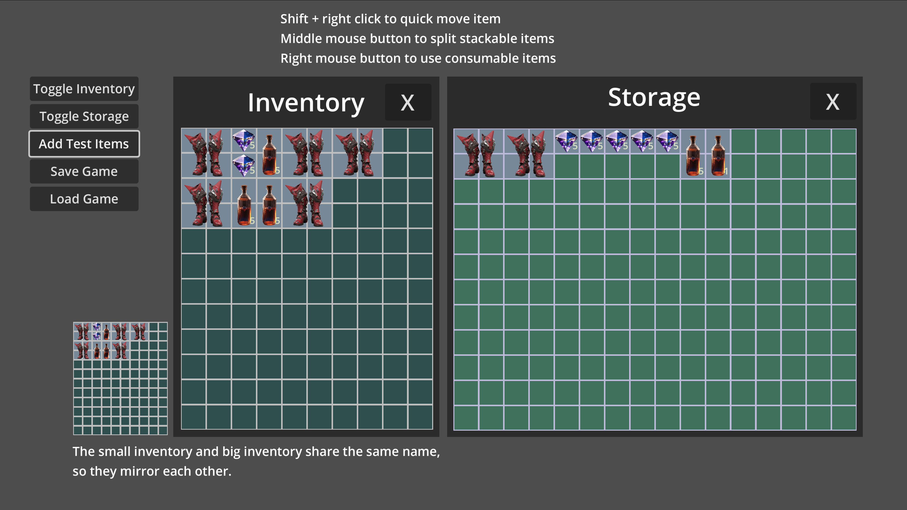

# grid-base-inventory-system-csharp

CSharp Version Of grid-base-inventory-system

Used QFramework

- base ：[grid-base-inventory-system](https://github.com/Cabbage0211/grid-base-inventory-system) 
- QFramework ：[QFramework](https://github.com/liangxiegame/QFramework) 

## 🖼️ Sample Screenshots  

  

## 🙏 Original Author
- [bilibili: Java已死游戏当立](https://space.bilibili.com/3546831153793300)

---

# 🎮 网格基础物品系统
grid-base-inventory-system的C#版本

尝试使用QFramework

- 原仓库 ：[grid-base-inventory-system](https://github.com/Cabbage0211/grid-base-inventory-system) 
- QFramework ：[QFramework](https://github.com/liangxiegame/QFramework) 

## 🙏 原作者（请关注）
- [B站: Java已死游戏当立](https://space.bilibili.com/3546831153793300)

---

[MIT License](LICENSE)
